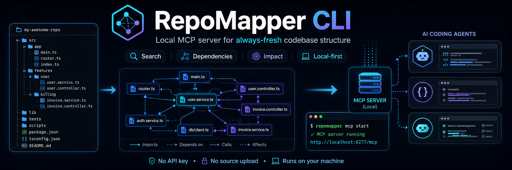

# RepoMapper CLI

[English](./README.md) | [Chinese](./README-zh-CN.md)

**A local MCP server that gives AI coding agents on-demand, always-fresh structural queries over a codebase.**

RepoMapper indexes repository structure locally and exposes it through MCP for Claude Code, Cursor, Codex, and other agent clients. Agents can ask for project context, directory slices, symbol search, fan-in/fan-out dependencies, hubs, and impact analysis without repeatedly spending context on grep, glob, and file-by-file rediscovery.

RepoMapper runs entirely on your machine. It does not require an AI API key and does not upload source code.




## Why RepoMapper

AI coding agents often rediscover the same repository facts before making a change: package scripts, entry points, important files, directory shape, imports, dependents, and likely blast radius. That exploration burns tokens and time, and it repeats whenever the task context changes.

RepoMapper turns repository structure into a queryable local index. An agent can request only the slice it needs: project overview, a bounded tree, files or symbols, direct imports, reverse dependents, dependency hubs, or the transitive impact of a changed file.

The MCP server watches the workspace with `chokidar` and keeps answers fresh as files change. Questions like "who depends on this file?" and "what can this edit affect?" become direct tool calls instead of a manual repository scan.

## Quick Start

Install MCP configuration for supported agent clients, then restart the client:

```bash
repomapper install --target auto --yes
```

You can also configure supported clients explicitly:

```bash
repomapper install --target claude,cursor,codex --yes
```

During local development, use `pnpm dev --` instead of `repomapper`:

```bash
pnpm dev -- install --target cursor --yes
pnpm dev -- serve . --mcp
```

To remove the integration, uninstall only the RepoMapper MCP entry while preserving other MCP servers:

```bash
repomapper uninstall --target auto --yes
```

## MCP Server

`repomapper serve --mcp` exposes repository context tools over stdio MCP:

```bash
repomapper serve . --mcp
```

Available tools:

| Tool                      | Purpose                                                                                                          |
| ------------------------- | ---------------------------------------------------------------------------------------------------------------- |
| `repomapper_context`      | Project overview: name, tech stack, features, entry points, important files, scripts, served-root warnings, and `recommendedNextReads`. |
| `repomapper_tree`         | Bounded directory tree by path and depth, with text and structured `entries`.                                    |
| `repomapper_search`       | Search files, directories, symbols, or all result types with token matching, glob-like patterns, paging metadata, and optional symbol snippets via `contextLines`. |
| `repomapper_grep`         | Search file contents by literal text or regex, with optional glob scoping, match limits, and context lines.      |
| `repomapper_read_file`    | Read an indexed repo-relative text file or line range without exposing arbitrary filesystem paths.               |
| `repomapper_file_info`    | File exports, internal symbols, imports, imported-by files, TS/JS `callsByExport`, and best-effort `importCallSites`; supports `fields`. |
| `repomapper_file_info_batch` | Batch file info for multiple paths with one refresh; supports the same `fields` selection.                   |
| `repomapper_imports`      | Direct fan-out dependencies for a file, with optional `limit` and `offset`.                                      |
| `repomapper_dependents`   | Direct fan-in dependents for a file, with optional `limit` and `offset`.                                         |
| `repomapper_hubs`         | Files with the most dependents.                                                                                  |
| `repomapper_impact`       | Direct and transitive reverse-dependency impact for changed files, including totals and optional explanation paths. |
| `repomapper_path_between` | Shortest reverse-dependency chain showing how a change in one file can propagate to another; returns direction hints and forward-path clues when the query is reversed. |
| `repomapper_refresh`      | Explicitly wait for pending watcher changes; ordinary query tools already refresh before answering.              |
| `repomapper_status`       | Index status, graph statistics, freshness, pending watcher changes, and a `nextAction` hint for explicit waits.  |

Manual MCP configuration:

```json
{
  "mcpServers": {
    "repomapper": {
      "type": "stdio",
      "command": "repomapper",
      "args": ["serve", "--mcp"]
    }
  }
}
```

## Workflow

1. **Lazy scan**: the MCP server starts quickly, then builds an in-memory index on the first query or during background warmup.
2. **Detect**: RepoMapper detects project name, tech stack, features, entry points, scripts, and high-signal files.
3. **Index**: it builds file-level import graphs for TS/JS, Python, and Go, plus lightweight TS/JS symbols and regex-level call edges.
4. **Watch**: `chokidar` marks changed files dirty without rebuilding the full index on every filesystem event.
5. **Refresh**: ordinary query tools automatically refresh dirty files before answering; `repomapper_refresh` is available when an agent wants to explicitly wait for pending watcher changes before a separate step. Added or deleted files trigger a fast full scan with atomic cache replacement.

## Agent Usage

In MCP mode, agents receive RepoMapper server instructions during initialization. Structural questions should prefer RepoMapper tools over ad hoc grep or repeated file reads. Content searches should use `repomapper_grep`; reading a known text file or line range should use `repomapper_read_file`. For large file-detail queries, pass `fields` or use `repomapper_file_info_batch` to keep responses small.

When first landing in an unfamiliar repository, start with `repomapper_context` and its `recommendedNextReads`, then use `repomapper_tree` for a bounded directory slice and `repomapper_hubs` for depended-on modules. `repomapper_path_between` follows reverse-dependency change propagation (`from` changed file → `to` affected file); use `repomapper_imports` for forward "what does this file import?" questions.

For local MCP debugging without writing a temporary SDK client, use the one-shot caller:

```bash
repomapper mcp call . repomapper_file_info --args '{"path":"src/core/config.ts","fields":["exports","importedBy"]}'
```

The optional `agents` command can generate an `AGENTS.md` guide. It is not a static project map; it records agent-facing navigation notes and working rules:

```bash
repomapper agents . --force
```

## CLI Reference

| Command           | Description                                                                                     |
| ----------------- | ----------------------------------------------------------------------------------------------- |
| `install`         | Write RepoMapper MCP configuration for Claude Code, Cursor, or Codex.                           |
| `uninstall`       | Remove only the RepoMapper MCP configuration from supported clients.                            |
| `serve [path]`    | Serve repository context tools over MCP stdio.                                                  |
| `scan [path]`     | Scan a repository and print a concise summary, or machine-readable JSON with `--json`.          |
| `doctor [path]`   | Check whether repository metadata is useful for agents, or emit JSON diagnostics with `--json`. |
| `affected [path]` | Print files and tests affected by changed files.                                                |
| `mcp call [path] <tool>` | Call a RepoMapper MCP tool once and print JSON; useful for local debugging.              |
| `agents [path]`   | Generate an AI coding agent guide in `AGENTS.md`.                                               |
| `init`            | Create `repomapper.config.json` in the current directory.                                       |

Common options:

| Option                    | Description                                                                             |
| ------------------------- | --------------------------------------------------------------------------------------- |
| `--mcp`                   | Enable stdio MCP mode for `serve`.                                                      |
| `--target <targets>`      | Target clients: `auto`, `claude`, `cursor`, `codex`, or a comma-separated list.         |
| `--print-config <target>` | Print an MCP config snippet without writing files.                                      |
| `--yes`                   | Confirm MCP config writes or removals.                                                  |
| `--files <files>`         | Explicit changed-file list for `affected`; omit it to read `git diff --name-only HEAD`. |
| `--depth <number>`        | Reverse-dependency traversal depth for `affected`; defaults to `2`.                     |
| `--json`                  | Emit JSON for `scan`, `doctor`, or `affected`.                                          |
| `--args <json>`           | JSON object passed to `mcp call`.                                                       |
| `--force`                 | Let `agents` overwrite an existing `AGENTS.md`.                                         |

## Local Development

```bash
pnpm install
pnpm build
pnpm dev -- --help
pnpm check
```

On Windows, use PowerShell 7 (`pwsh`) or explicitly read repository text as UTF-8 when inspecting Chinese help text, for example `Get-Content -Encoding UTF8 README-zh-CN.md`. Runtime CLI help and MCP tool descriptions are UTF-8 text; garbled display usually means the terminal/read command decoded the file with a legacy code page.

## Local-First Design

- No external API calls.
- No AI API key required.
- No source upload.
- Only local filesystem scanning.
- Skips cache and vendor directories such as `node_modules/`, `dist/`, `build/`, `.git/`, and `coverage/` by default.

## Scope

RepoMapper is:

- a local stdio MCP server for on-demand repository structure queries
- a file-level import graph and impact-analysis helper
- a fast navigation layer for AI coding agents
- a local diagnostic CLI with `scan`, `doctor`, and `affected`

RepoMapper is not:

- a static project documentation generator
- a complete semantic code graph
- a language server
- a vector database
- an AI code review tool
- a persistent code index or database

## Tech Stack

- TypeScript 5.x
- Node.js 22+
- Commander
- fast-glob + ignore + fs-extra
- Zod + jsonc-parser + yaml + smol-toml
- picocolors + ora + cli-table3 + debug
- tsup
- Vitest
- ESLint 9 Flat Config + Prettier
- Changesets

## License

[MIT](./LICENSE)
